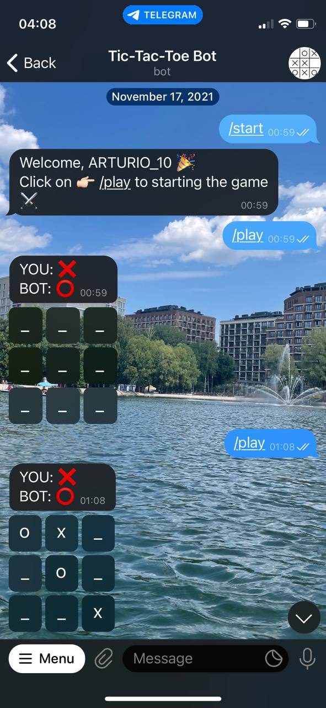

# Telegram Bot: XO (Tic-Tac-Toe)
___
## Gameplay
**Tic-Tac-Toe** is played on a three-by-three grid by two players, who alternately place the marks **X** and **O** in one of the nine spaces in the grid.

Players soon discover that the best play from both parties leads to a draw. Hence, tic-tac-toe is often played by young children who may not have discovered the **optimal strategy**.

Because of the simplicity of tic-tac-toe, it is often used as a pedagogical tool for teaching the concepts of good sportsmanship and the branch of artificial intelligence that deals with the searching of game trees. It is straightforward to write a computer program to play tic-tac-toe perfectly or to enumerate the 765 essentially different positions (the state space complexity).

## Idea
Based on the foregoing we can assume that the bot is capable of never losing with the right strategy (using the [minimax algorithm](https://en.wikipedia.org/wiki/Minimax)).

## Instruction
Create a Telegram bot with _[BotFather](https://t.me/botfather)_ before connecting your bot to Telegram.

1. Start a new conversation with the _BotFather_.
2. Send _/newbot_ to create a new Telegram bot.
3. When asked, enter a name for the bot.
4. Give the Telegram bot a unique username. Note that the bot name must end with the word **"bot"** (case-insensitive).
5. Copy and save the Telegram bot's access.
6. Writing received token (as string) in 5th line of the file _bot.py_.

You can read more about creating a telegram bot in python and deploying it on the server [here](https://blog.logrocket.com/build-deploy-telegram-bot-with-flask/).

## Example
